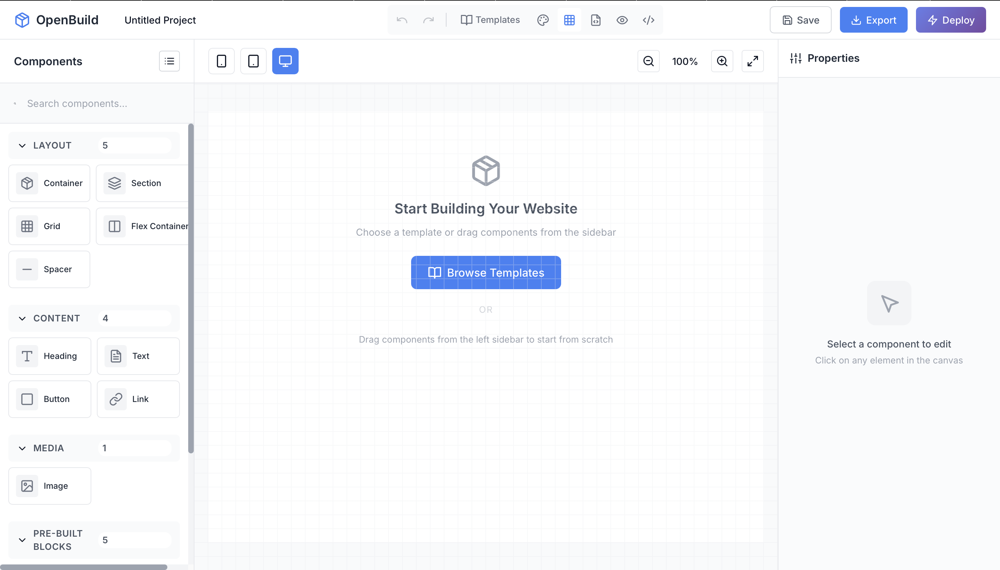

# OpenBuild - Open Source Website Builder

<div align="center">
  
</div>

<div align="center">

[](https://vercel.com/new/clone?repository-url=https%3A%2F%2Fgithub.com%2FGrandillionaire%2Fopenbuild)
[](https://app.netlify.com/start/deploy?repository=https://github.com/Grandillionaire/openbuild)

</div>

<div align="center">
  
  
  
  
</div>

<div align="center">
  
  
  
  
  
  
</div>

<p align="center">
  <strong>I was bored and built this because I don't understand why people use Squarespace.</strong><br>
  <em>OpenBuild actually lets you see the code and modify it however you like.</em>
</p>

<p align="center">
  <a href="#-features">Features</a> •
  <a href="#-demo">Demo</a> •
  <a href="#-quick-start">Quick Start</a> •
  <a href="#-docker">Docker</a> •
  <a href="#-tech-stack">Tech Stack</a> •
  <a href="#-contributing">Contributing</a>
</p>

---

## 🎬 Demo

🌐 **[Try OpenBuild Live →](https://openbuild-five.vercel.app)**


## ✨ Features

- **🤖 Smart Component Generator**: Describe what you want, get instant results
- **🎯 Drag & Drop Editor**: Intuitive visual interface for building websites
- **🧩 15+ Components**: Layout, content, media, and pre-built blocks
- **📱 Responsive Design**: Built-in controls for mobile, tablet, and desktop
- **🎨 Real-time Styling**: Visual property editor with live preview
- **💻 Clean Code Generation**: Produces semantic HTML and optimized CSS
- **📦 Export & Deploy**: Download as ZIP or deploy directly to Vercel
- **💾 Auto-Save**: Local storage with automatic project saving
- **↩️ Undo/Redo**: Full history tracking for easy corrections
- **⚡ Performance**: 60fps editing experience with optimized rendering
- **📲 PWA Support**: Install as a native app, works offline
- **⌨️ Keyboard Shortcuts**: Power-user friendly (press `?` for help)

### 🤖 Smart Component Generation

Generate components using natural language! Just click the sparkle button in the bottom-right corner and describe what you want:

```
"A hero section with a gradient background, large heading, 
subtitle, and call-to-action button"
```

The generator understands common patterns like:
- **Hero sections** - Landing page headers with CTAs
- **Feature grids** - Showcase your product features
- **Contact forms** - User input sections
- **Cards** - Reusable content blocks

Choose from style presets: Modern, Minimal, Bold, or Elegant.

## 🚀 Quick Start

### Development

```bash
# Install dependencies
npm install

# Start development server
npm run dev

# Build for production
npm run build
```

### One-Click Deploy

Deploy your own instance with one click:

[](https://vercel.com/new/clone?repository-url=https%3A%2F%2Fgithub.com%2FGrandillionaire%2Fopenbuild)

[](https://app.netlify.com/start/deploy?repository=https://github.com/Grandillionaire/openbuild)

## 🐳 Docker

### Quick Start with Docker

```bash
# Build and run with Docker Compose
docker-compose up -d

# Or build manually
docker build -t openbuild .
docker run -p 3000:80 openbuild
```

### Development with Docker

```bash
# Run development server with hot reload
docker-compose --profile dev up openbuild-dev
```

The app will be available at `http://localhost:3000` (production) or `http://localhost:5173` (development).

### Docker Compose Services

| Service | Port | Description |
|---------|------|-------------|
| `openbuild` | 3000 | Production build with nginx |
| `openbuild-dev` | 5173 | Development with hot reload |

## 🛠️ Tech Stack

<div align="center">
  
</div>

- **Vue 3.4+**: Modern reactive framework with Composition API
- **TypeScript**: Type-safe development experience
- **Vite 5.0+**: Lightning-fast build tooling
- **Pinia**: Next-generation state management
- **UnoCSS**: Atomic CSS with Tailwind compatibility
- **CodeMirror 6**: Advanced code editor
- **Dexie.js**: IndexedDB wrapper for local storage

## ⌨️ Keyboard Shortcuts

Press `?` at any time to see all shortcuts. Here are the essentials:

| Shortcut | Action |
|----------|--------|
| `⌘/Ctrl + S` | Save project |
| `⌘/Ctrl + Z` | Undo |
| `⌘/Ctrl + Shift + Z` | Redo |
| `⌘/Ctrl + D` | Duplicate component |
| `⌘/Ctrl + K` | Command palette |
| `Delete` | Delete selected |
| `Escape` | Clear selection |
| `?` | Show shortcuts |

## 📦 Components

### Layout Components
- **Container**: Responsive max-width wrapper
- **Section**: Full-width section blocks
- **Grid**: Flexible grid system
- **Flex**: Flexbox container
- **Spacer**: Vertical spacing element

### Content Components
- **Heading**: H1-H6 with styling options
- **Text**: Paragraph blocks
- **Button**: Interactive buttons with hover states
- **Link**: Styled anchor elements
- **Image**: Responsive images

### Pre-built Blocks
- **Hero**: Landing page hero sections
- **Features**: Feature showcase grids
- **CTA**: Call-to-action sections
- **Navigation**: Responsive nav bars
- **Footer**: Site footer blocks

## 🎯 Usage

1. **Add Components**: Drag components from the left sidebar onto the canvas
2. **Edit Properties**: Select any component to modify its content and styles
3. **Responsive Design**: Use viewport controls to design for different screen sizes
4. **Export Project**: Download your website as a ZIP file with clean code
5. **Deploy**: One-click deployment to Vercel (requires API token)

## 🔧 Configuration

### Environment Variables

Create a `.env.local` file for local development:

```env
VITE_VERCEL_TOKEN=your_vercel_token_here
```

## 📋 Requirements

- Node.js 18+ or 20+
- npm 9+
- Modern browser with ES6+ support

## 📊 Performance

OpenBuild is optimized for performance:

- **First Contentful Paint**: < 1s
- **Time to Interactive**: < 2s
- **Bundle Size**: < 200KB (gzipped)
- **Lighthouse Score**: 95+

## 📸 Screenshots

### Key Features:
- **Rich Component Library** - 15+ pre-built components
- **Visual Property Editor** - Real-time style updates
- **Responsive Design Tools** - Mobile, tablet, and desktop views
- **Clean Code Export** - Production-ready HTML/CSS/JS

## 🤝 Contributing

We love contributions! Please see our [Contributing Guide](CONTRIBUTING.md) for details.

### Contributors

<a href="https://github.com/Grandillionaire/openbuild/graphs/contributors">
  
</a>

## 📈 Star History

<a href="https://star-history.com/#Grandillionaire/openbuild&Date">
  <picture>
    <source media="(prefers-color-scheme: dark)" srcset="https://api.star-history.com/svg?repos=Grandillionaire/openbuild&type=Date&theme=dark" />
    <source media="(prefers-color-scheme: light)" srcset="https://api.star-history.com/svg?repos=Grandillionaire/openbuild&type=Date" />
    
  </picture>
</a>

## 🔒 Security

For security issues, please see our [Security Policy](SECURITY.md).

## 📄 License

This project is licensed under the MIT License with attribution requirement - see the [LICENSE](LICENSE) file for details.

### Attribution

OpenBuild was originally created by **Grandillionaire (Maximillian Grand)**. Any use, modification, or distribution of this software must include attribution to the original creator.

## 🙏 Acknowledgments

- Built with ❤️ by **Grandillionaire (Maximillian Grand)**
- Powered by Vue 3, TypeScript, and modern web technologies
- Special thanks to all contributors and the open source community

---

<p align="center">
  <strong>⭐ Star this repository if you find it helpful!</strong>
</p>

<p align="center">
  Made with ❤️ by <a href="https://github.com/grandillionaire">Grandillionaire</a>
</p>
