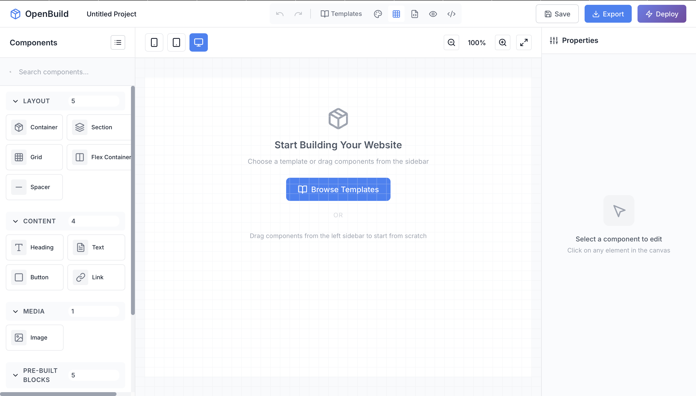

<div align="center">
  

  <h1>OpenBuild</h1>

  <p><strong>The open-source visual website builder with built-in commerce.</strong><br>
  Drag, drop, sell. Free forever, self-hostable, no lock-in.</p>

  <p>
    <a href="#quick-start">Quick start</a> ·
    <a href="#commerce">Commerce</a> ·
    <a href="#architecture">Architecture</a> ·
    <a href="docs/COMMERCE.md">Commerce guide</a> ·
    <a href="docs/ARCHITECTURE.md">Architecture deep-dive</a> ·
    <a href="CONTRIBUTING.md">Contributing</a>
  </p>

  <p>
    
    
    
    
    
    
  </p>

  <p>
    <a href="https://openbuild-five.vercel.app"><strong>Try it live →</strong></a>
  </p>
</div>

---

OpenBuild is a free alternative to Squarespace, Wix and Webflow — but the code is yours, the data is yours, and there's no monthly bill. Build a marketing site, a portfolio, a blog, or a fully functional online store; export to clean, framework-free HTML/CSS/JS or to a Vite project; deploy anywhere static hosting lives.

Where most "free" website builders force you onto a hosted plan the moment you want a custom domain or to accept payments, OpenBuild ships its commerce engine with the editor. Wire it to your own Stripe account in 30 seconds and you have a working store — no backend required for single-product checkouts, with a clean extension point for multi-item carts.

## Why OpenBuild

|                          | Squarespace | Wix  | Webflow | **OpenBuild** |
| ------------------------ | :---------: | :--: | :-----: | :-----------: |
| Monthly fee              |    $16+     | $17+ |  $14+   |    **$0**     |
| Own your code & data     |     ❌      |  ❌  | Partial |    **✅**     |
| Self-host anywhere       |     ❌      |  ❌  |   ❌    |    **✅**     |
| Drag & drop editor       |     ✅      |  ✅  |   ✅    |    **✅**     |
| Built-in Stripe checkout |     ✅      |  ✅  | Plugin  |    **✅**     |
| Export to clean HTML     |     ❌      |  ❌  | Limited |    **✅**     |
| Open source              |     ❌      |  ❌  |   ❌    |  **✅ MIT**   |
| Plugin system            |     ❌      |  ❌  |   ❌    |    **✅**     |

## Features

### Visual editor

- **45+ components** across layout, content, media, blocks, forms and commerce
- **Drag & drop** with smart snapping, alignment guides and live preview
- **Responsive design** with per-breakpoint overrides (mobile / tablet / desktop)
- **Multi-page sites** with global theme tokens (colors, fonts, spacing scale)
- **Theme system** with CSS custom properties — design once, restyle anywhere
- **Undo / redo** with a real command-pattern history (50 states deep)
- **Command palette** (⌘K) and full keyboard shortcuts
- **Tutorial system** with interactive overlays for first-time users
- **AI component generator** — describe what you want in plain English

### Commerce (built in, free, no subscription)

- **Products** with images, variants (size/color), inventory, SKUs, compare-at pricing
- **Categories, tags, collections**
- **Cart drawer** with localStorage persistence — works on any exported site
- **Stripe Payment Links** — no backend required, free to use
- **Stripe Checkout Sessions** — point at your own endpoint for multi-item carts
- **Custom webhook** mode — plug in any payment processor
- **25 currencies** including JPY zero-decimal handling
- **Tax rules** by country / region with `included-in-price` support — editor-side only
- **Shipping zones** with free-shipping thresholds — editor-side only
- **Discount codes** (percentage and fixed) with min-subtotal and expiry — editor-side only
- **FAQ component** emits schema.org JSON-LD for richer search results
- **SEO** with auto-generated meta, OG, Twitter Card and canonical tags
- **Multi-page export** with `sitemap.xml` and `robots.txt` (set your Site URL in the export options — the sitemap needs an absolute domain)

> Tax, shipping and discounts are modelled and calculated in the editor
> (`src/services/commerceService.ts`). The exported storefront runtime shows a
> **subtotal** and hands the final amount to your payment provider — it does not
> compute tax or shipping in the customer's browser.

### Engineering

- **TypeScript strict** across the codebase
- **ESLint flat config** with `--max-warnings=0` in CI
- **Vitest** unit tests with v8 coverage, **Playwright** for end-to-end
- **Bundle budget** enforced in CI (250 KB gzipped for initial route)
- **License policy** check — fails CI if a GPL dep sneaks in
- **Telemetry interface** — drop in Sentry/Bugsnag with one line
- **Plugin API** — third parties can ship components, exporters, integrations
- **Per-Node-version matrix** on CI (Node 20.x and 22.x)
- **PWA** with offline support and installable manifest

## Quick start

```bash
git clone https://github.com/maximilliangrand/openbuild.git
cd openbuild
npm install
npm run dev
# open http://localhost:5173
```

Build a production bundle:

```bash
npm run build
npm run preview
```

Run the full quality gate (lint, typecheck, tests, build):

```bash
npm run check
```

## Commerce

The shortest path to a working store:

1. Open **Store** in the editor's left sidebar
2. Click **Add demo products** (or **New product** to start from scratch)
3. In **Store settings**, set checkout mode to **Stripe Payment Links**
4. Paste a `https://buy.stripe.com/…` link on each product
5. Drop the **Product Grid** component on your page
6. Export, deploy, sell

For multi-item carts, choose **Stripe Checkout Session** and point at any endpoint that returns `{ url: 'https://checkout.stripe.com/…' }`. See [docs/COMMERCE.md](docs/COMMERCE.md) for a complete walkthrough including a 40-line serverless function template.

## Architecture

OpenBuild is a Vue 3 + Pinia SPA that compiles to static assets. The interesting parts:

- **`src/types/`** — the domain model (components, pages, commerce, projects)
- **`src/config/components.ts`** — every renderable component, defined as an immutable `ComponentDefinition` with `generateHTML` and `generateCSS`
- **`src/stores/`** — `editor`, `pages`, `theme`, `commerce` — Pinia stores with persisted state
- **`src/services/`** — pure, framework-free logic: code generation, export, commerce math, AI, storage
- **`src/lib/plugins.ts`** — plugin registry. Components, exporters and integrations all register through one interface
- **`src/lib/telemetry.ts`** — error/event reporter interface. No-op by default; drop in your provider with `setTelemetryReporter()`
- **`src/services/commerceRuntime.ts`** — self-contained ~10 KB JS that ships with exported sites to power cart and checkout

Read the full deep-dive in [docs/ARCHITECTURE.md](docs/ARCHITECTURE.md).

## Plugin system

Add a custom component without forking:

```ts
import { registerPlugin } from '@/lib/plugins';

registerPlugin({
  id: 'my-org.calendar',
  name: 'Calendar widget',
  version: '1.0.0',
  components: [
    {
      type: 'calendar' as never,
      displayName: 'Calendar',
      category: 'blocks',
      icon: 'calendar',
      defaultProps: { content: { calendarUrl: '' } },
      defaultStyles: { base: { width: '100%' } },
      generateHTML: (c) => `<iframe src="${c.props.content.calendarUrl}" loading="lazy"></iframe>`,
      generateCSS: () => '',
    },
  ],
});
```

Components registered this way appear in the editor immediately, including after
the editor has booted. The registry also accepts **exporters** and
**integrations** (`getRegisteredExporters()` / `getRegisteredIntegrations()`) —
the interfaces are stable, but the editor does not consume them yet.

## Project quality

| Signal        | Status                                                           |
| ------------- | ---------------------------------------------------------------- |
| TypeScript    | strict, `noUnusedLocals`, `noUnusedParameters`                   |
| Lint          | ESLint 9 flat config, 0 warnings tolerated in CI                 |
| Tests         | Vitest + Playwright, per-PR coverage upload                      |
| CI            | Node 20.x + 22.x matrix, bundle budget, license audit, npm audit |
| Performance   | < 250 KB gzipped initial route, code-split editor & UI chunks    |
| Accessibility | semantic HTML across components, ARIA on interactive bits        |
| Security      | sandboxed embed wrappers, sanitized URLs, CSP-friendly export    |

## Deployment

One-click:

[](https://vercel.com/new/clone?repository-url=https%3A%2F%2Fgithub.com%2Fmaximilliangrand%2Fopenbuild)
[](https://app.netlify.com/start/deploy?repository=https://github.com/maximilliangrand/openbuild)

Docker:

```bash
docker compose up -d        # production at http://localhost:3000
docker compose --profile dev up openbuild-dev   # dev at http://localhost:5173
```

## Roadmap

See [ROADMAP.md](docs/ROADMAP.md) for the full plan. Highlights:

- Real-time multi-cursor collaboration
- Form submissions endpoint (with anti-spam)
- Headless CMS connector (Sanity, Contentful, Strapi)
- A11y audit panel
- Visual regression diff on PRs

## Contributing

We love contributions — bugfixes, components, exporters, translations. Read [CONTRIBUTING.md](CONTRIBUTING.md), check the issue tracker for `good first issue` labels, or open a discussion.

## License

MIT. See [LICENSE](LICENSE).

## Credits

OpenBuild was originally created by **[maximilliangrand (Maximillian Grand)](https://github.com/maximilliangrand)** and is built on Vue 3, Pinia, TypeScript, UnoCSS, CodeMirror 6, Dexie and Vite — every one of them open source, every one of them excellent.

<div align="center">
  <p><strong>If OpenBuild helps you ship something, star the repo ⭐</strong></p>
</div>
